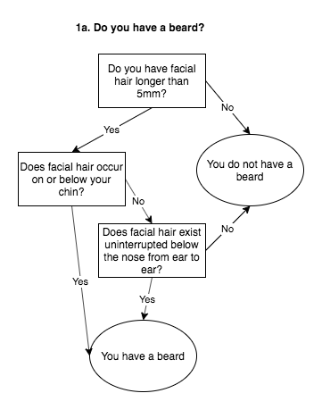

# Example rules as code

This repo is for implementations of the made-up [Australian Beard Tax
(Promotion of Enlightenment Values) Act 1934](legislation.pdf).

Its purpose is to show the breadth of options in writing legislation as code,
explore some of the pros and cons of different options, and to give you a
starting point for encoding real legislation.

Implementations are for the following decision tree:



The legislation reads:

```legislation
In this Act, beard means any facial hair no shorter than 5 millimetres in
length that:
a. occurs on or below the chin, or
b. exists in an uninterrupted line from the front of one ear to the front of
   the other ear below the nose.
```

## How to contribute

Please add implementations of the decision trees and tests in other languages
and formats.

- Add a new folder in the root directory.
- Create a README.md with details about how to run the code.
- Make a pull request!

You can use the examples included in the `shared` directory to write tests and
make sure your code passes.
