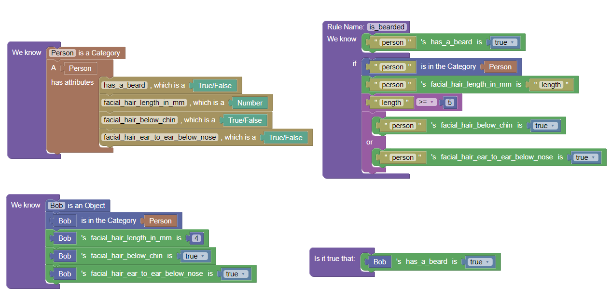

# Blawx Implementation

Please note that the public alpha version of Blawx is unstable. It is very possible that this implementation will stop working when
changes are made to the app. If that happens, let @Gauntlet173 on GitHub know.

## Usage

Download the `beard.blawx` file in this folder.
Go to the [Blawx Live Alpha version](https://www.blawx.com/demo), start the app.
Choose "Menu", "Load Workspace" and upload the `beard.blawx` file.

It should look something like this:

You can then use Blawx to add facts, and ask questions about the known facts given the rules.

The existing query is one that asks whether there were any tests, and if so whether those tests passed.

## Testing

`test.py` sends the .json data in the shared folder to the Blawx.com reasoner, and runs the default query, displaying the result on
one line.

## Advanced

If you would like to use a version of the code with that deals with jurisdiction and exemptions, use the `beard_advanced.blawx` file
instead. It does not include the same testing rules.
